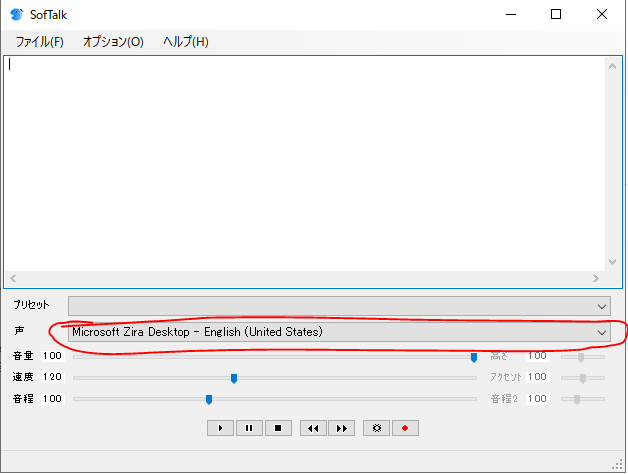
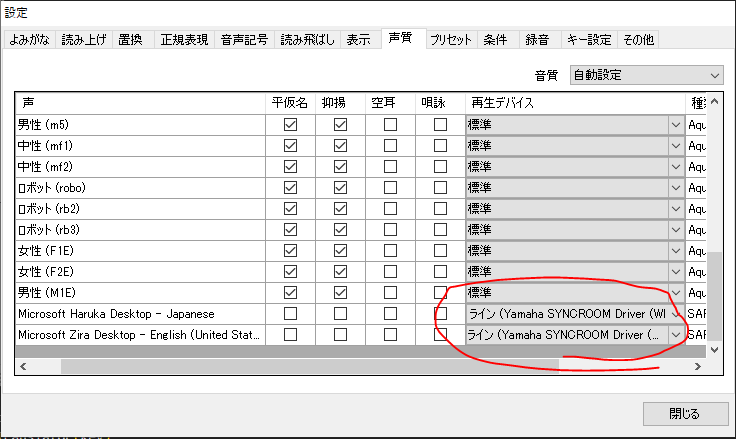

# RealTimeTranslate

Installation
========
1. Virtual audio driver installation.  
[Syncroom Download](https://syncroom.yamaha.com/play/dl/)


2. Install the module from PyPI.
```
pip install -r requirements.txt
```


Usage
========
1. Obtain API key for translator.  
[Deepl API](https://www.deepl.com/pro-api?cta=header-pro-api)

2. Enter the obtained API key into the config.  
Example : key = 12345678-9abc-def0-1234-56789abcde:fx


3. Execution method.  
```
python Translate.py
```


4. Stop method.  
When you say stop, it stops.


Config
========
- Softalk language settings.
Start Softalk.exe in the Softalk file to set it up.



オプション->環境設定->声質  
Change the location of the red circle in the image to Yamaha SYNCROOM Driver.
(Destination language location.)



- Configuration of config.
  - API_KEY
    - key 		  : 	Deepl API Key.

  - TRANSLATE_SETTINGS
    - source_lang 	: 	The language you speak.
    - target_lang	:	Target Language.

  - TALK_SETTINGS -
    - speed		:	Talk Speed.
    - hide		:	Hide Softalk.


License
========
MIT license, see the LICENSE file.  
Softalk is also available for commercial use if you do not use AquesTalk.
